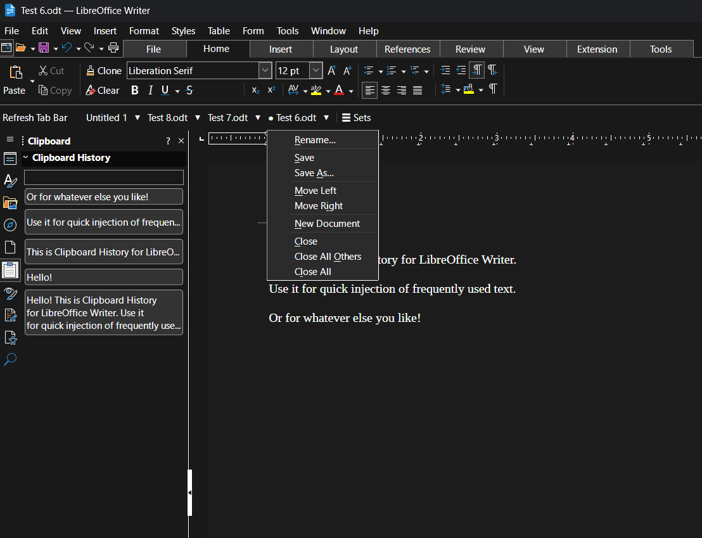

# Tab Bar for LibreOffice Writer

A document tab bar for LibreOffice Writer. All open Writer documents appear as clickable tabs in a toolbar — switch, manage, and organise your documents without touching the Window menu.



## Features

- **One tab per open document** — click to switch instantly
- **Active tab indicator** — the current document is marked with `●`
- **Modified indicator** — unsaved documents show `*` in the tab name
- **Per-tab menu (▾)** — Rename, Save, Save As, Move Left / Move Right, New Document, Close, Close All Others, Close All
- **Saved Tab Sets** — save your current group of open documents and restore them in one click; supports multiple named sets
- **Restore Last Session** — automatically reopens the documents you had open when you last quit
- **Tab Key Switching** — optional Ctrl+Tab / Ctrl+Shift+Tab cycling between tabs (toggle in the Sets menu; off by default)
- **Cross-platform** — Windows, macOS, Linux (XDG-compliant config paths)

## Installation

### From the .oxt file
1. Download `TabBar.oxt` from the [Releases](https://github.com/lyricalvanity/tabbar-libreoffice/releases) page.
2. In LibreOffice: **Tools → Extension Manager → Add…**
3. Select the `.oxt` file and follow the prompts.
4. Restart LibreOffice when asked.

### Enabling the tab bar
After installation, click **Enable Tab Bar** in the toolbar that appears. The tab bar will populate with your open documents immediately.

## Building from source

Requires LibreOffice's bundled Python (or any Python 3.x):

```bash
cd TabBar
/path/to/libreoffice/program/python build.py
# Output: ../TabBar.oxt
```

On Windows with a default LibreOffice install:
```
"C:\Program Files\LibreOffice\program\python.exe" build.py
```

## Configuration

Settings and saved sets are stored in a single JSON file:

| Platform | Path |
|----------|------|
| Windows  | `%APPDATA%\LibreOffice\tabbar_sets.json` |
| macOS    | `~/Library/Application Support/LibreOffice/tabbar_sets.json` |
| Linux    | `$XDG_CONFIG_HOME/libreoffice/tabbar_sets.json` (default: `~/.config/libreoffice/`) |

## Debug logging

Debug logging is off by default. To enable, set the environment variable `TABBAR_DEBUG=1` before launching LibreOffice. The log is written to `tab_bar.log` in the same config directory as above.

## License

[Mozilla Public License 2.0](LICENSE)
